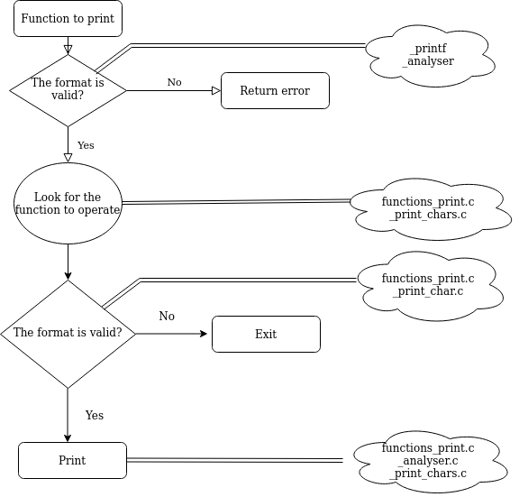

<h1>PRINTF PROJECT</h1>

<h2>PURPOSE</h2>
In order to apply different knowledges we have learned, in this project we've been encouraged to create our own function "printf", based on the printf function included in the standard libraries in C language.
<h2>HOW TO DOWNLOAD</h2>
For download this function, you need clone this repo, you can do it of this way:
+Execute the followings commands in your terminal.
+git clone https://github.com/acamilojuan/printf

<h2>HOW TO INSTALL THIS FUNCTION</h2>
Once you have downloaded the repository, go to the folder where all the function files are and run the following command:
+ gcc -Wall -Werror -Wextra -pedantic *.c
+ this command what it does is to compile all the files of our function.

<h2>HOW TO USE AND EXAMPLES</h2>
#include "holberton.h"

+ _printf("33%d, 41%i, d%c, holberton%s"); the output will be: 33, 41, d, holberton
+ _printf ("Holberton School%s"); the output will be: Holberton School
+ _printf("Juan Acevedo & Duvan Jaramillo"); the output will be: Juan Acevedo & Duvan Jaramillo

<h2>REQUIREMENTS</h2>
+ The function have to print the information requested in the standard output. 
+ It must print with different types of datas and formats. 
+ The function must be created without using global variables, functions and macros differents to *_write, malloc, free and the variadic ones_*  

<h2>FLOW CHART</h2>

<h3>AUTHORS</h3>
- Duvan Jaramillo 
- Juan Acevedo
